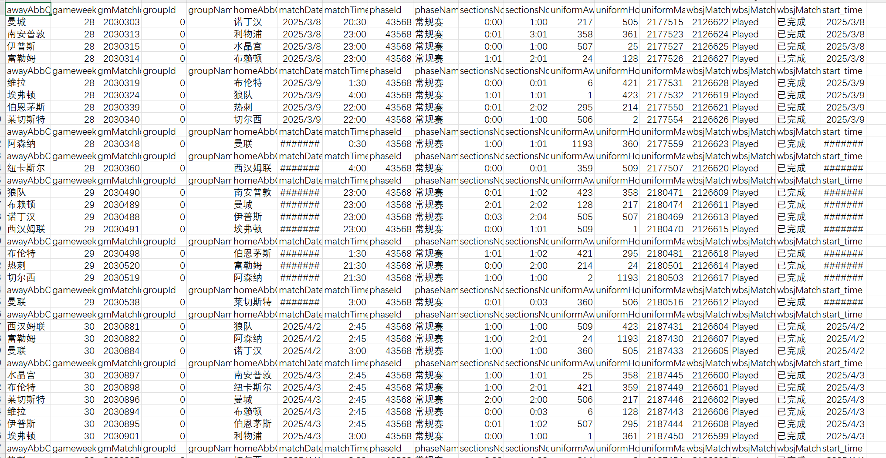
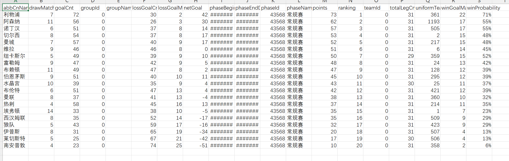

# python-Crawler
初步了解怎么爬取足球联赛赛程赛果,并保存到excle表里

## 安装依赖
  1.安装requests库,pandas库
```bash
pip install requests
pip install pandas
```

## 快速开始
  这里主要分为爬取和保存数据两个部分
输入指令运行xinxinet.py爬取赛程赛果
```bash
python xinxinet.py
```
输入指令运行xinxinet2.py爬取积分结果
```bash
python xinxinet2.py
```
  ### 爬取
1.找到想要爬取的网页的url
2.使用requests.get获取网页内容
3.将内容转化为json格式
```bash
import requests,json,csv
import pandas as pd
url = "这里填要爬取的网页的url"
response = requests.get(url=url)#获取网页内容
a=response.text
c=json.loads(a)
print(c)#可以查看获取到的内容
```
以这个网页(https://webapi.sporttery.cn/gateway/uniform/football/league/getLeagueV1.qry?uniformLeagueId=72&)为例
获取到的数据如下
```bash
{'dataFrom': '', 'emptyFlag': False, 'errorCode': '0', 'errorMessage': '处理成功', 'success': True, 'value': {'seasonStartDate': '2024-08-16', 'endDate': '2025-04-07', 'seasonId': 11817, 'matchList': [{'matchDate': '2025-03-08', 'subMatchList': [{'awayAbbCnName': '曼城', 'gameweek': '28', 'gmMatchId': 2030303, 'groupId': 0, 'groupName': '', 'homeAbbCnName': '诺丁汉', 'matchDate': '2025-03-08', 'matchTime': '20:30', 'phaseId': 43568, 'phaseName': '常规赛', 'sectionsNo1': '0:0', 'sectionsNo999': '1:0', 'uniformAwayTeamId': 217, 'uniformHomeTeamId': 505, 'uniformMatchId': 2177515, 'wbsjMatchId': 2126622, 'wbsjMatchSc': 'Played', 'wbsjMatchScDesc': '已完成'}, {'awayAbbCnName': '南安普敦', 'gameweek': '28', 'gmMatchId': 2030313, 'groupId': 0, 'groupName': '', 'homeAbbCnName': '利物浦', 'matchDate': '2025-03-08', 'matchTime': '23:00', 'phaseId': 43568, 'phaseName': '常规赛', 'sectionsNo1': '0:1', 'sectionsNo999': '3:1', 'uniformAwayTeamId': 358, 'uniformHomeTeamId': 361, 'uniformMatchId': 2177523, 'wbsjMatchId': 2126624, 'wbsjMatchSc': 'Played', 'wbsjMatchScDesc': '已完成'}, {'awayAbbCnName': '伊普斯', 'gameweek': '28', 'gmMatchId': 2030315, 'groupId': 0, 'groupName': '', 'homeAbbCnName': '水晶宫', 'matchDate': '2025-03-08', 'matchTime': '23:00', 'phaseId': 43568, 'phaseName': '常规赛', 'sectionsNo1': '0:0', 'sectionsNo999': '1:0', 'uniformAwayTeamId': 507, 'uniformHomeTeamId': 25, 'uniformMatchId': 2177527, 'wbsjMatchId': 2126625, 'wbsjMatchSc': 'Played', 'wbsjMatchScDesc': '已完成'}, {'awayAbbCnName': '富勒姆', 'gameweek': '28', 'gmMatchId': 2030314, 'groupId': 0, 'groupName': '', 'homeAbbCnName': '布赖顿', 'matchDate': '2025-03-08', 'matchTime': '23:00', 'phaseId': 43568, 'phaseName': '常规赛', 'sectionsNo1': '1:1', 'sectionsNo999': '2:1', 'uniformAwayTeamId': 24, 'uniformHomeTeamId': 128, 'uniformMatchId': 2177526, 'wbsjMatchId': 2126627, 'wbsjMatchSc': 'Played', 'wbsjMatchScDesc': '已完成'}], 'isToday': 0}, {'matchDate': '2025-03-09', 'subMatchList': [{'awayAbbCnName': '维拉', 'gameweek': '28', 'gmMatchId': 2030319, 'groupId': 0, 'groupName': '', 'homeAbbCnName': '布伦特', 'matchDate': '2025-03-09', 'matchTime': '01:30', 'phaseId': 43568, 'phaseName': '常规赛', 'sectionsNo1': '0:0', 'sectionsNo999': '0:1', 'uniformAwayTeamId': 6, 'uniformHomeTeamId': 421, 'uniformMatchId': 2177531, 'wbsjMatchId': 2126628, 'wbsjMatchSc': 'Played', 'wbsjMatchScDesc': '已完成'}, {'awayAbbCnName': '埃弗顿', 'gameweek': '28', 'gmMatchId': 2030324, 'groupId': 0, 'groupName': '', 'homeAbbCnName': '狼队', 'matchDate': '2025-03-09', 'matchTime': '04:00', 'phaseId': 43568, 'phaseName': '常规赛', 'sectionsNo1': '1:1', 'sectionsNo999': '1:1', 'uniformAwayTeamId': 1, 'uniformHomeTeamId': 423, 'uniformMatchId': 2177532, 'wbsjMatchId': 2126619, 'wbsjMatchSc': 'Played', 'wbsjMatchScDesc': '已完成'}, {'awayAbbCnName': '伯恩茅斯', 'gameweek': '28', 'gmMatchId': 2030339, 'groupId': 0, 'groupName': '', 'homeAbbCnName': '热刺', 'matchDate': '2025-03-09', 'matchTime': '22:00', 'phaseId': 43568, 'phaseName': '常规赛', 'sectionsNo1': '0:1', 'sectionsNo999': '2:2', 'uniformAwayTeamId': 295, 'uniformHomeTeamId': 214, 'uniformMatchId': 2177550, 'wbsjMatchId': 2126621, 'wbsjMatchSc': 'Played', 'wbsjMatchScDesc': '已完成'}, {'awayAbbCnName': '莱切斯特', 'gameweek': '28', 'gmMatchId': 2030340, 'groupId': 0, 'groupName': '', 'homeAbbCnName': '切尔西', 'matchDate': '2025-03-09', 'matchTime': '22:00', 'phaseId': 43568, 'phaseName': '常规赛', 'sectionsNo1': '0:0', 'sectionsNo999': '1:0', 'uniformAwayTeamId': 506, 'uniformHomeTeamId': 2, 'uniformMatchId': 2177554, 'wbsjMatchId': 2126626, 'wbsjMatchSc': 'Played', 'wbsjMatchScDesc': '已完成'}], 'isToday': 0}, {'matchDate': '2025-03-10', 'subMatchList': [{'awayAbbCnName': '阿森纳', 'gameweek': '28', 'gmMatchId': 2030348, 'groupId': 0, 'groupName': '', 'homeAbbCnName': '曼联', 'matchDate': '2025-03-10', 'matchTime': '00:30', 'phaseId': 43568, 'phaseName': '常规赛', 'sectionsNo1': '1:0', 'sectionsNo999': '1:1', 'uniformAwayTeamId': 1193, 'uniformHomeTeamId': 360, 'uniformMatchId': 2177559, 'wbsjMatchId': 2126623, 'wbsjMatchSc': 'Played', 'wbsjMatchScDesc': '已完成'}], 'isToday': 0}, {'matchDate': '2025-03-11', 'subMatchList': [{'awayAbbCnName': '纽卡斯尔', 'gameweek': '28', 'gmMatchId': 2030360, 'groupId': 0, 'groupName': '', 'homeAbbCnName': '西汉姆联', 'matchDate': '2025-03-11', 'matchTime': '04:00', 'phaseId': 43568, 'phaseName': '常规赛', 'sectionsNo1': '0:0', 'sectionsNo999': '0:1', 'uniformAwayTeamId': 359, 'uniformHomeTeamId': 509, 'uniformMatchId': 2177507, 'wbsjMatchId': 2126620, 'wbsjMatchSc': 'Played', 'wbsjMatchScDesc': '已完成'}], 'isToday': 0}, {'matchDate': '2025-03-15', 'subMatchList': [{'awayAbbCnName': '狼队', 'gameweek': '29', 'gmMatchId': 2030490, 'groupId': 0, 'groupName': '', 'homeAbbCnName': '南安普敦', 'matchDate': '2025-03-15', 'matchTime': '23:00', 'phaseId': 43568, 'phaseName': '常规赛', 'sectionsNo1': '0:1', 'sectionsNo999': '1:2', 'uniformAwayTeamId': 423, 'uniformHomeTeamId': 358, 'uniformMatchId': 2180471, 'wbsjMatchId': 2126609, 'wbsjMatchSc': 'Played', 'wbsjMatchScDesc': '已完成'}, {'awayAbbCnName': '布赖顿', 'gameweek': '29', 'gmMatchId': 2030489, 'groupId': 0, 'groupName': '', 'homeAbbCnName': '曼城', 'matchDate': '2025-03-15', 'matchTime': '23:00', 'phaseId': 43568, 'phaseName': '常规赛', 'sectionsNo1': '2:1', 'sectionsNo999': '2:2', 'uniformAwayTeamId': 128, 'uniformHomeTeamId': 217, 'uniformMatchId': 2180474, 'wbsjMatchId': 2126611, 'wbsjMatchSc': 'Played', 'wbsjMatchScDesc': '已完成'}, {'awayAbbCnName': '诺丁汉', 'gameweek': '29', 'gmMatchId': 2030488, 'groupId': 0, 'groupName': '', 'homeAbbCnName': '伊普斯', 'matchDate': '2025-03-15', 'matchTime': '23:00', 'phaseId': 43568, 'phaseName': '常规赛', 'sectionsNo1': '0:3', 'sectionsNo999': '2:4', 'uniformAwayTeamId': 505, 'uniformHomeTeamId': 507, 'uniformMatchId': 2180469, 'wbsjMatchId': 2126613, 'wbsjMatchSc': 'Played', 'wbsjMatchScDesc': '已完成'}, {'awayAbbCnName': '西汉姆联', 'gameweek': '29', 'gmMatchId': 2030491, 'groupId': 0, 'groupName': '', 'homeAbbCnName': '埃弗顿', 'matchDate': '2025-03-15', 'matchTime': '23:00', 'phaseId': 43568, 'phaseName': '常规赛', 'sectionsNo1': '0:0', 'sectionsNo999': '1:1', 'uniformAwayTeamId': 509, 'uniformHomeTeamId': 1, 'uniformMatchId': 2180470, 'wbsjMatchId': 2126615, 'wbsjMatchSc': 'Played', 'wbsjMatchScDesc': '已完成'}], 'isToday': 0}, {'matchDate': '2025-03-16', 'subMatchList': [{'awayAbbCnName': '布伦特', 'gameweek': '29', 'gmMatchId': 2030498, 'groupId': 0, 'groupName': '', 'homeAbbCnName': '伯恩茅斯', 'matchDate': '2025-03-16', 'matchTime': '01:30', 'phaseId': 43568, 'phaseName': '常规赛', 'sectionsNo1': '1:1', 'sectionsNo999': '1:2', 'uniformAwayTeamId': 421, 'uniformHomeTeamId': 295, 'uniformMatchId': 2180481, 'wbsjMatchId': 2126618, 'wbsjMatchSc': 'Played', 'wbsjMatchScDesc': '已完成'}, {'awayAbbCnName': '热刺', 'gameweek': '29', 'gmMatchId': 2030520, 'groupId': 0, 'groupName': '', 'homeAbbCnName': '富勒姆', 'matchDate': '2025-03-16', 'matchTime': '21:30', 'phaseId': 43568, 'phaseName': '常规赛', 'sectionsNo1': '0:0', 'sectionsNo999': '2:0', 'uniformAwayTeamId': 214, 'uniformHomeTeamId': 24, 'uniformMatchId': 2180501, 'wbsjMatchId': 2126614, 'wbsjMatchSc': 'Played', 'wbsjMatchScDesc': '已完成'}, {'awayAbbCnName': '切尔西', 'gameweek': '29', 'gmMatchId': 2030519, 'groupId': 0, 'groupName': '', 'homeAbbCnName': '阿森纳', 'matchDate': '2025-03-16', 'matchTime': '21:30', 'phaseId': 43568, 'phaseName': '常规赛', 'sectionsNo1': '1:0', 'sectionsNo999': '1:0', 'uniformAwayTeamId': 2, 'uniformHomeTeamId': 1193, 'uniformMatchId': 2180503, 'wbsjMatchId': 2126617, 'wbsjMatchSc': 'Played', 'wbsjMatchScDesc': '已完成'}], 'isToday': 0}, {'matchDate': '2025-03-17', 'subMatchList': [{'awayAbbCnName': '曼联', 'gameweek': '29', 'gmMatchId': 2030538, 'groupId': 0, 'groupName': '', 'homeAbbCnName': '莱切斯特', 'matchDate': '2025-03-17', 'matchTime': '03:00', 'phaseId': 43568, 'phaseName': '常规赛', 'sectionsNo1': '0:1', 'sectionsNo999': '0:3', 'uniformAwayTeamId': 360, 'uniformHomeTeamId': 506, 'uniformMatchId': 2180516, 'wbsjMatchId': 2126612, 'wbsjMatchSc': 'Played', 'wbsjMatchScDesc': '已完成'}], 'isToday': 0}, {'matchDate': '2025-04-02', 'subMatchList': [{'awayAbbCnName': '西汉姆联', 'gameweek': '30', 'gmMatchId': 2030881, 'groupId': 0, 'groupName': '', 'homeAbbCnName': '狼队', 'matchDate': '2025-04-02', 'matchTime': '02:45', 'phaseId': 43568, 'phaseName': '常规赛', 'sectionsNo1': '1:0', 'sectionsNo999': '1:0', 'uniformAwayTeamId': 509, 'uniformHomeTeamId': 423, 'uniformMatchId': 2187431, 'wbsjMatchId': 2126604, 'wbsjMatchSc': 'Played', 'wbsjMatchScDesc': '已完成'}, {'awayAbbCnName': '富勒姆', 'gameweek': '30', 'gmMatchId': 2030882, 'groupId': 0, 'groupName': '', 'homeAbbCnName': '阿森纳', 'matchDate': '2025-04-02', 'matchTime': '02:45', 'phaseId': 43568, 'phaseName': '常规赛', 'sectionsNo1': '1:0', 'sectionsNo999': '2:1', 'uniformAwayTeamId': 24, 'uniformHomeTeamId': 1193, 'uniformMatchId': 2187430, 'wbsjMatchId': 2126607, 'wbsjMatchSc': 'Played', 'wbsjMatchScDesc': '已完成'}, {'awayAbbCnName': '曼联', 'gameweek': '30', 'gmMatchId': 2030884, 'groupId': 0, 'groupName': '', 'homeAbbCnName': '诺丁汉', 'matchDate': '2025-04-02', 'matchTime': '03:00', 'phaseId': 43568, 'phaseName': '常规赛', 'sectionsNo1': '1:0', 'sectionsNo999': '1:0', 'uniformAwayTeamId': 360, 'uniformHomeTeamId': 505, 'uniformMatchId': 2187433, 'wbsjMatchId': 2126605, 'wbsjMatchSc': 'Played', 'wbsjMatchScDesc': '已完成'}], 'isToday': 0}, {'matchDate': '2025-04-03', 'subMatchList': [{'awayAbbCnName': '水晶宫', 'gameweek': '30', 'gmMatchId': 2030897, 'groupId': 0, 'groupName': '', 'homeAbbCnName': '南安普敦', 'matchDate': '2025-04-03', 'matchTime': '02:45', 'phaseId': 43568, 'phaseName': '常规赛', 'sectionsNo1': '1:0', 'sectionsNo999': '1:1', 'uniformAwayTeamId': 25, 'uniformHomeTeamId': 358, 'uniformMatchId': 2187445, 'wbsjMatchId': 2126600, 'wbsjMatchSc': 'Played', 'wbsjMatchScDesc': '已完成'}, {'awayAbbCnName': '布伦特', 'gameweek': '30', 'gmMatchId': 2030898, 'groupId': 0, 'groupName': '', 'homeAbbCnName': '纽卡斯尔', 'matchDate': '2025-04-03', 'matchTime': '02:45', 'phaseId': 43568, 'phaseName': '常规赛', 'sectionsNo1': '1:0', 'sectionsNo999': '2:1', 'uniformAwayTeamId': 421, 'uniformHomeTeamId': 359, 'uniformMatchId': 2187449, 'wbsjMatchId': 2126601, 'wbsjMatchSc': 'Played', 'wbsjMatchScDesc': '已完成'}, {'awayAbbCnName': '莱切斯特', 'gameweek': '30', 'gmMatchId': 2030896, 'groupId': 0, 'groupName': '', 'homeAbbCnName': '曼城', 'matchDate': '2025-04-03', 'matchTime': '02:45', 'phaseId': 43568, 'phaseName': '常规赛', 'sectionsNo1': '2:0', 'sectionsNo999': '2:0', 'uniformAwayTeamId': 506, 'uniformHomeTeamId': 217, 'uniformMatchId': 2187446, 'wbsjMatchId': 2126602, 'wbsjMatchSc': 'Played', 'wbsjMatchScDesc': '已完成'}, {'awayAbbCnName': '维拉', 'gameweek': '30', 'gmMatchId': 2030894, 'groupId': 0, 'groupName': '', 'homeAbbCnName': '布赖顿', 'matchDate': '2025-04-03', 'matchTime': '02:45', 'phaseId': 43568, 'phaseName': '常规赛', 'sectionsNo1': '0:0', 'sectionsNo999': '0:3', 'uniformAwayTeamId': 6, 'uniformHomeTeamId': 128, 'uniformMatchId': 2187443, 'wbsjMatchId': 2126606, 'wbsjMatchSc': 'Played', 'wbsjMatchScDesc': '已完成'}, {'awayAbbCnName': '伊普斯', 'gameweek': '30', 'gmMatchId': 2030895, 'groupId': 0, 'groupName': '', 'homeAbbCnName': '伯恩茅斯', 'matchDate': '2025-04-03', 'matchTime': '02:45', 'phaseId': 43568, 'phaseName': '常规赛', 'sectionsNo1': '0:1', 'sectionsNo999': '1:2', 'uniformAwayTeamId': 507, 'uniformHomeTeamId': 295, 'uniformMatchId': 2187444, 'wbsjMatchId': 2126608, 'wbsjMatchSc': 'Played', 'wbsjMatchScDesc': '已完成'}, {'awayAbbCnName': '埃弗顿', 'gameweek': '30', 'gmMatchId': 2030901, 'groupId': 0, 'groupName': '', 'homeAbbCnName': '利物浦', 'matchDate': '2025-04-03', 'matchTime': '03:00', 'phaseId': 43568, 'phaseName': '常规赛', 'sectionsNo1': '0:0', 'sectionsNo999': '1:0', 'uniformAwayTeamId': 1, 'uniformHomeTeamId': 361, 'uniformMatchId': 2187450, 'wbsjMatchId': 2126599, 'wbsjMatchSc': 'Played', 'wbsjMatchScDesc': '已完成'}], 'isToday': 0}, {'matchDate': '2025-04-04', 'subMatchList': [{'awayAbbCnName': '热刺', 'gameweek': '30', 'gmMatchId': 2030905, 'groupId': 0, 'groupName': '', 'homeAbbCnName': '切尔西', 'matchDate': '2025-04-04', 'matchTime': '03:00', 'phaseId': 43568, 'phaseName': '常规赛', 'sectionsNo1': '0:0', 'sectionsNo999': '1:0', 'uniformAwayTeamId': 214, 'uniformHomeTeamId': 2, 'uniformMatchId': 2187454, 'wbsjMatchId': 2126603, 'wbsjMatchSc': 'Played', 'wbsjMatchScDesc': '已完成'}], 'isToday': 0}, {'matchDate': '2025-04-05', 'subMatchList': [{'awayAbbCnName': '阿森纳', 'gameweek': '31', 'gmMatchId': 2030959, 'groupId': 0, 'groupName': '', 'homeAbbCnName': '埃弗顿', 'matchDate': '2025-04-05', 'matchTime': '19:30', 'phaseId': 43568, 'phaseName': '常规赛', 'sectionsNo1': '0:1', 'sectionsNo999': '1:1', 'uniformAwayTeamId': 1193, 'uniformHomeTeamId': 1, 'uniformMatchId': 2188483, 'wbsjMatchId': 2126595, 'wbsjMatchSc': 'Played', 'wbsjMatchScDesc': '已完成'}, {'awayAbbCnName': '伯恩茅斯', 'gameweek': '31', 'gmMatchId': 2030969, 'groupId': 0, 'groupName': '', 'homeAbbCnName': '西汉姆联', 'matchDate': '2025-04-05', 'matchTime': '22:00', 'phaseId': 43568, 'phaseName': '常规赛', 'sectionsNo1': '0:1', 'sectionsNo999': '2:2', 'uniformAwayTeamId': 295, 'uniformHomeTeamId': 509, 'uniformMatchId': 2188492, 'wbsjMatchId': 2126589, 'wbsjMatchSc': 'Played', 'wbsjMatchScDesc': '已完成'}, {'awayAbbCnName': '狼队', 'gameweek': '31', 'gmMatchId': 2030968, 'groupId': 0, 'groupName': '', 'homeAbbCnName': '伊普斯', 'matchDate': '2025-04-05', 'matchTime': '22:00', 'phaseId': 43568, 'phaseName': '常规赛', 'sectionsNo1': '1:0', 'sectionsNo999': '1:2', 'uniformAwayTeamId': 423, 'uniformHomeTeamId': 507, 'uniformMatchId': 2188490, 'wbsjMatchId': 2126593, 'wbsjMatchSc': 'Played', 'wbsjMatchScDesc': '已完成'}, {'awayAbbCnName': '布赖顿', 'gameweek': '31', 'gmMatchId': 2030967, 'groupId': 0, 'groupName': '', 'homeAbbCnName': '水晶宫', 'matchDate': '2025-04-05', 'matchTime': '22:00', 'phaseId': 43568, 'phaseName': '常规赛', 'sectionsNo1': '1:1', 'sectionsNo999': '2:1', 'uniformAwayTeamId': 128, 'uniformHomeTeamId': 25, 'uniformMatchId': 2188494, 'wbsjMatchId': 2126596, 'wbsjMatchSc': 'Played', 'wbsjMatchScDesc': '已完成'}], 'isToday': 0}, {'matchDate': '2025-04-06', 'subMatchList': [{'awayAbbCnName': '诺丁汉', 'gameweek': '31', 'gmMatchId': 2030976, 'groupId': 0, 'groupName': '', 'homeAbbCnName': '维拉', 'matchDate': '2025-04-06', 'matchTime': '00:30', 'phaseId': 43568, 'phaseName': '常规赛', 'sectionsNo1': '2:0', 'sectionsNo999': '2:1', 'uniformAwayTeamId': 505, 'uniformHomeTeamId': 6, 'uniformMatchId': 2188499, 'wbsjMatchId': 2126598, 'wbsjMatchSc': 'Played', 'wbsjMatchScDesc': '已完成'}, {'awayAbbCnName': '南安普敦', 'gameweek': '31', 'gmMatchId': 2030996, 'groupId': 0, 'groupName': '', 'homeAbbCnName': '热刺', 'matchDate': '2025-04-06', 'matchTime': '21:00', 'phaseId': 43568, 'phaseName': '常规赛', 'sectionsNo1': '2:0', 'sectionsNo999': '3:1', 'uniformAwayTeamId': 358, 'uniformHomeTeamId': 214, 'uniformMatchId': 2188522, 'wbsjMatchId': 2126590, 'wbsjMatchSc': 'Played', 'wbsjMatchScDesc': '已完成'}, {'awayAbbCnName': '利物浦', 'gameweek': '31', 'gmMatchId': 2030995, 'groupId': 0, 'groupName': '', 'homeAbbCnName': '富勒姆', 'matchDate': '2025-04-06', 'matchTime': '21:00', 'phaseId': 43568, 'phaseName': '常规赛', 'sectionsNo1': '3:1', 'sectionsNo999': '3:2', 'uniformAwayTeamId': 361, 'uniformHomeTeamId': 24, 'uniformMatchId': 2188524, 'wbsjMatchId': 2126594, 'wbsjMatchSc': 'Played', 'wbsjMatchScDesc': '已完成'}, {'awayAbbCnName': '切尔西', 'gameweek': '31', 'gmMatchId': 2030994, 'groupId': 0, 'groupName': '', 'homeAbbCnName': '布伦特', 'matchDate': '2025-04-06', 'matchTime': '21:00', 'phaseId': 43568, 'phaseName': '常规赛', 'sectionsNo1': '0:0', 'sectionsNo999': '0:0', 'uniformAwayTeamId': 2, 'uniformHomeTeamId': 421, 'uniformMatchId': 2188521, 'wbsjMatchId': 2126597, 'wbsjMatchSc': 'Played', 'wbsjMatchScDesc': '已完成'}, {'awayAbbCnName': '曼城', 'gameweek': '31', 'gmMatchId': 2031006, 'groupId': 0, 'groupName': '', 'homeAbbCnName': '曼联', 'matchDate': '2025-04-06', 'matchTime': '23:30', 'phaseId': 43568, 'phaseName': '常规赛', 'sectionsNo1': '0:0', 'sectionsNo999': '0:0', 'uniformAwayTeamId': 217, 'uniformHomeTeamId': 360, 'uniformMatchId': 2188528, 'wbsjMatchId': 2126591, 'wbsjMatchSc': 'Played', 'wbsjMatchScDesc': '已完成'}], 'isToday': 0}], 'startDate': '2025-03-01', 'seasonEndDate': '2025-05-26', 'uniformLeagueId': 72}}
```
我们需要的赛程结果保存在了"value"里,将其提取出来
```bash
response = c['value']['matchList']#简化获取到的数据
```
到这里我们的数据就爬取完了
  ### 保存数据到excel
使用pandas库来进行这一操作
我们要先将数据整理为一个字典
通过这个个代码获取到数据的所有键值用于创建字典(后面用于excel表第一列的列标)
```bash
columns = []
for d in c[0]["subMatchList"][0].keys():
    columns.append(d)
```
这部分代码遍历数据所有的值，保存到字典中对应的键值下
```bash
dp = {}
for i in columns:#遍历键值表
    e = []
    for j in c[n]["subMatchList"]:#查找每一组数据中这个键值对应的值
        e.append(j[i])
    dp[i] = e#创建字典
```
最后将字典转化为DataFrame对象，并存入excel表格
```bash
df = pd.DataFrame(dp, index=range(0,len(dp["matchTime"])))
df.to_csv('zl1.csv',encoding="utf-16",sep=",",index=False,mode="a")
```
## 结果
赛程赛果文档
<div align="center" style="display: flex; gap: 20px;">
    
</div>
积分文档
<div align="center" style="display: flex; gap: 20px;">
    
</div>
